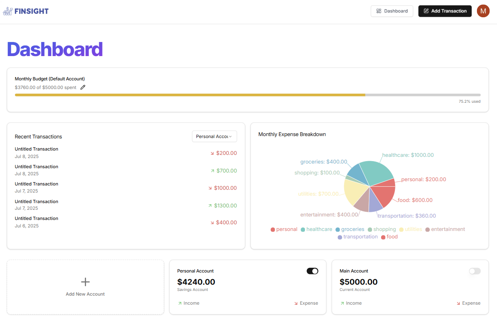
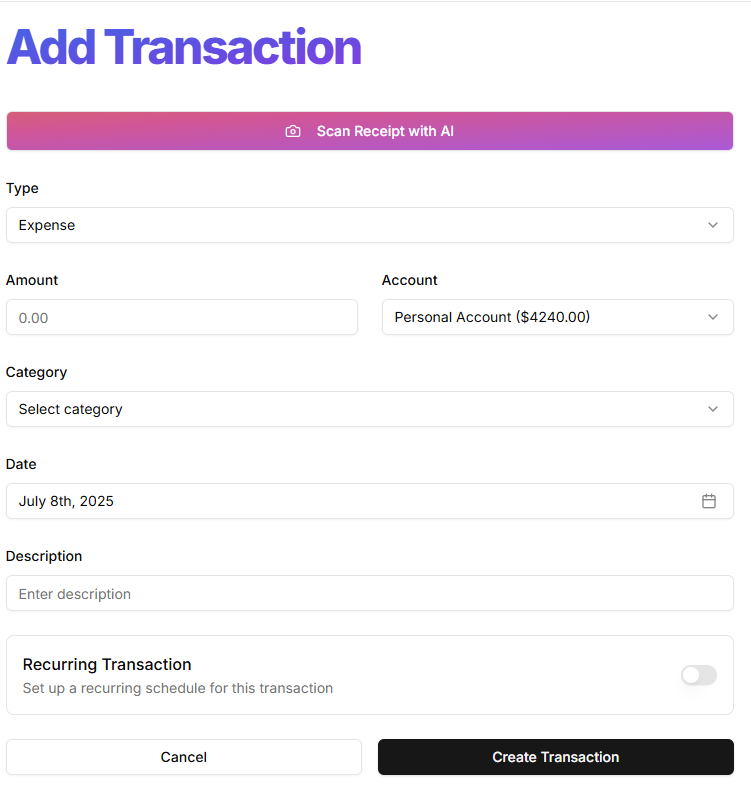
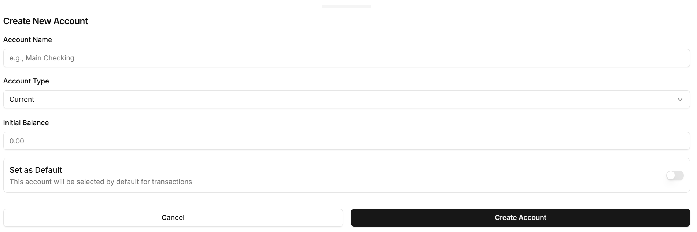
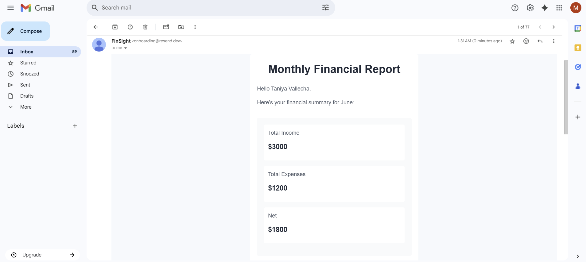

# 🌟 FinSight – Your AI-Powered Financial Tracker

FinSight is your **smart financial assistant** designed to help you track expenses, manage accounts, and gain actionable insights into your spending habits. With AI-generated reports, receipt scanning, and intuitive dashboards, FinSight gives you a complete picture of your finances.  

---

## 🚀 Features

✅ **AI Insights in Monthly Reports** – Get monthly report emails and personalised insights and improvements.  
📸 **Receipt Scanner** – Scan receipts to instantly add transactions to your account.  
👥 **Manage Multiple Accounts** – Monitor expenses and balances across all your accounts in one place.  
📊 **Insightful Dashboard** – Visualize income, expenses, and trends with interactive graphs and charts.  
🔔 **Budget Alerts** – Get notified when you cross 80% of your budget.  
📅 **Recurring Transactions** – Automatically handle subscriptions, EMIs, and regular expenses.  
📱 **Responsive Design** – Optimized for mobile, tablet, and desktop.  

---

## 🛠 Tech Stack

- **Frontend**: [Next.js](https://nextjs.org/), [React](https://react.dev/), [Tailwind CSS](https://tailwindcss.com/)  
- **Backend**: [Prisma](https://www.prisma.io/), Node.js  
- **AI Integration**: [Gemini API](https://deepmind.google/technologies/gemini/) for financial insights  
- **Task Scheduler**: [Inngest](https://www.inngest.com/) for background jobs and cron tasks  
- **Hosting**: [Vercel](https://vercel.com/)  
- **Email Service**: Resend API for sending beautifully designed React email templates  

---

## 📸 Screenshots

### 🏠 Dashboard

### 📃 Scan Receipts to Add Transactions

### 👥 Manage Multiple Accounts

### 📈 Monthly Reports with AI Insights

.png)

